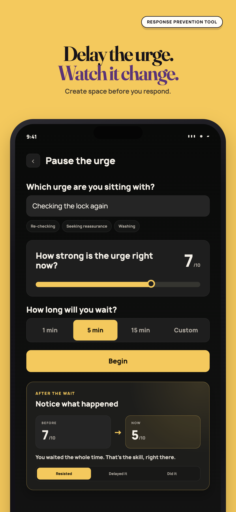
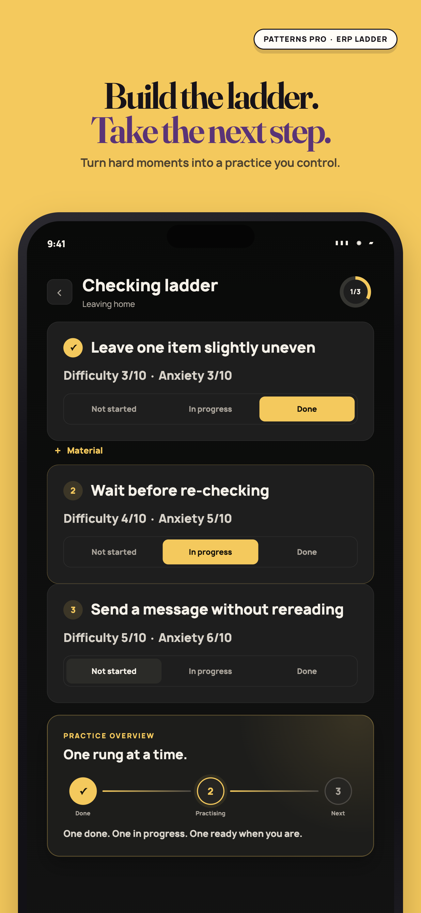
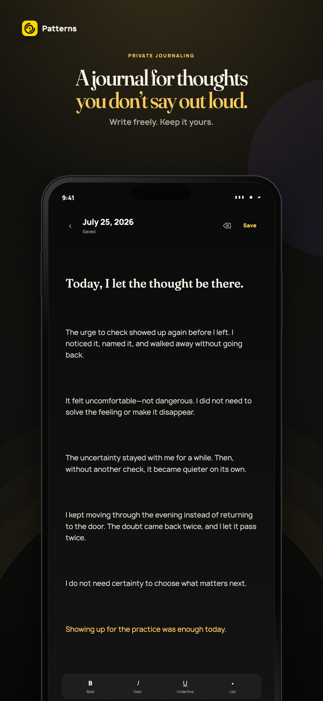
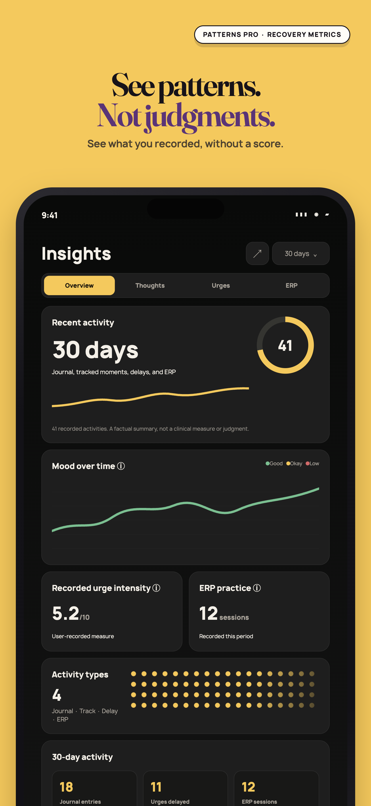
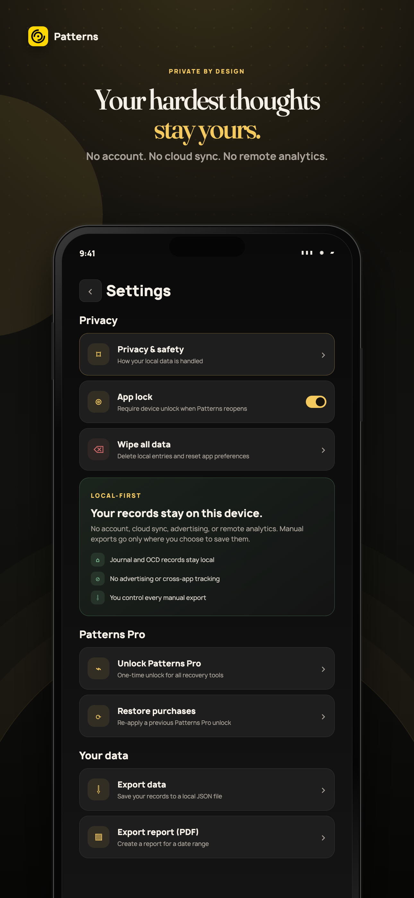

  

<h1 align="center">Patterns</h1>

  <strong>A private OCD app for journaling, tracking, and ERP.</strong>

  See the loop. Choose your next response.

  
  
  
  

  
  
  

  

Patterns is a local-first OCD app. It gives you a quiet place to write, log obsessions and compulsions, delay an urge, and practise exposure and response prevention, without an account or anyone else reading your notes.

It is for personal reflection and self-tracking. It does not diagnose, treat, prevent, or cure any condition, and it is not a replacement for care from a qualified clinician.

## Download

- **iPhone and iPad:** [App Store](https://apps.apple.com/us/app/patterns-ocd-journaling/id6762611172)
- **Android:** [Google Play](https://play.google.com/store/apps/details?id=com.maskedsyntax.patterns)
- **Site and guides:** [patternsocd.com](https://patternsocd.com/)

Requires iOS 14 or later, or Android 8 or later.

## A look inside

  
  
  

  
  

## What you can do

**Journal**
A dated writing space for the thoughts you do not say out loud. Prompts are there on the days a blank page is too much.

**Track OCD events**
Log an obsession or a compulsion as it happens, and rate distress from 0 to 10. The same SUDS scale used in ERP, so the notes travel well to a session.

**Practise ERP**
Delay a compulsion, sit with an exposure, and keep the scripts and materials you actually use. Free tools cover guided ERP, compulsion delay, grounding, and a coping library. Patterns Pro unlocks the fuller toolkit: exposure hierarchy, response prevention, structured programs, urge surfing, and more.

**See patterns, not judgments**
Insights show how often you practise, how urges move, and how consistent the week was. Progress is practice, not a score you can be graded on.

## Privacy

Patterns is local-first. Journal entries, OCD events, distress ratings, practice logs, and preferences stay on your device. There is no account, no cloud sync, no ads, and no remote analytics.

You can lock the app behind the device passcode, delete a single day, or wipe local data from Settings. Manual export writes an unencrypted JSON or PDF file wherever you choose, so keep those files somewhere private.

## Community

- **[Discussions](https://github.com/gentleloop-labs/patterns/discussions):** questions, ideas, and what is working for you
- **[Issues](https://github.com/gentleloop-labs/patterns/issues):** bugs and technical requests
- **[Website](https://patternsocd.com/):** guides, the toolkit, and the honest roadmap

Please be kind. People open this app on hard days.
